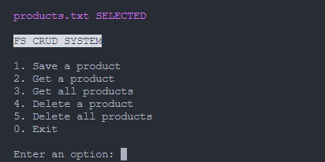
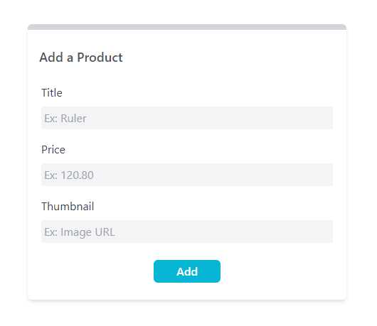

# Coderhouse Backend Challenges

This repository contains all coderhouse backend challenges.

## Challenge 1 (Classes)

Create a class User and invoke all its methods.

```js
export class User {
  constructor(name, lastname, books, pets) {
    this.name = name
    this.lastname = lastname
    this.books = books
    this.pets = pets
  }

  getFullName = () => `${this.name} ${this.lastname}`

  addPet = (name) => this.pets.push(name)

  countPets = () => this.pets.length

  addBook = (title, author) => this.books.push({title, author})

  getBookNames = () => this.books.map(book => book.title)
}
```

## Challenge 2 (File Management)

### `FileSystem CRUD`

Nodejs FileSystem (fs) CRUD implementation using promises.




```js
// Interfaces
Container {
  fileName: String

  save: (Product) => Number
  getById: (Number) => Product
  getAll: () => Product[]
  deleteById: (Number) => void
  deleteAll: () => void
}

Product {
  id: String
  title: String
  price: Number
  thumbnail: String
}
```

### Libraries

- **`fs (file system)`** (The Node.js file system module allows you to work with the file system on your computer)
- **`uuid`** (Used for creating unique ids)
- **`readline-sync`** (Synchronous Readline for interactively running to have a conversation with the user via a console (TTY) )
- **`colors`** (Used to get colors in the node.js console)

## Challenge 3 (NodeJS-Express Server)

Basic server with NodeJS and Express.

```js
/* Import and init express */
const express = require('express')
const app = express()
```

```js
/* Endpoints */
app.get('/products', async (req, res) => {
  try {
    const products = await container.getAll()
    res.send(products)
  } catch (err) {
    console.log(err.message)
    res.status(500).send('An error has ocurred getting all products')
  }
})

app.get('/randomProduct', async (req, res) => {
  try {
    const randomProduct = await container.getRandom()
    res.send(randomProduct)
  } catch (err) {
    console.log(err.message)
    res.status(500).send('An error has ocurred getting a random product')
  }
})

app.get('*', (req, res) => {
  res.status(404).send('Error 404: Page not found')
})
```

```js
/* Server configuration */
const server = app.listen(PORT, () => {
  console.log(`Server is up and running on port ${PORT}`)
})

server.on('error', err => {
  console.log(err.message)
})
```

### Libraries

- **`express`** (Popular framework for NodeJS, intended for use in building web applications and APIs.)

## Challenge 4 (API RESTfull)

API RESTfull of products implementation using NodeJS and Express

```js
/* Middleware and routes config */
app.use(express.json())
app.use(express.urlencoded({ extended: true }))
app.use(express.static('public'))
app.use(logger)

app.use('/api', apiRoutes)
app.get('*', (req, res) => {
  res.status(404).sendFile(path.join(__dirname, '/public/pages/404.html'))
})
```

```js
/* Products PUT and DELETE methods */
router.put('/:id', async (req, res) => {
  try {
    const {
      params: { id },
      body: { title, price, thumbnail }
    } = req

    if (!title || !price || !thumbnail) {
      return res.status(400).json({
        success: false,
        error:
          'Wrong body format: title, price and thumbnail fields are required'
      })
    }
    if (typeof title !== 'string') {
      return res.status(400).json({
        success: false,
        error: 'Wrong body format: title must be a string'
      })
    }
    if (typeof price !== 'number') {
      return res.status(400).json({
        success: false,
        error: 'Wrong body format: price must be a number'
      })
    }
    if (typeof thumbnail !== 'string') {
      return res.status(400).json({
        success: false,
        error: 'Wrong body format: thumbnail must be a string'
      })
    }

    const productUpdated = { id, title, price, thumbnail }
    const updateByIdResult = await container.updateById(productUpdated)

    if (updateByIdResult === -1) {
      return res.status(404).json({
        success: false,
        error: `Product with id: ${id} does not exist`
      })
    } else {
      return res.json({ success: true, result: productUpdated })
    }
  } catch (err) {
    res.status(500).json({
      success: false,
      error: 'An error has ocurred updating the product'
    })
  }
})

router.delete('/:id', async (req, res) => {
  try {
    const { id } = req.params
    const deleteByIdResult = await container.deleteById(id)

    if (deleteByIdResult === -1) {
      return res.status(404).json({
        success: false,
        error: `Product with id: ${id} does not exist`
      })
    } else {
      return res.json({
        success: true,
        result: `Product with id: ${id} deleted`
      })
    }
  } catch (err) {
    res.status(500).json({
      success: false,
      error: 'An error has ocurred deleting the product'
    })
  }
})
```

### `Product Entry Form`

The server have a public space that contains an index.html document with a product entry form in order to add a product.



```js
/* Form submit event */
form.addEventListener('submit', handleSubmit)

async function handleSubmit(evt) {
  evt.preventDefault()

  const title = inputTitle.value
  const price = Number(inputPrice.value)
  const thumbnail = inputThumbnail.value

  const product = {
    title,
    price,
    thumbnail
  }

  try {
    // POST request
    const response = await fetch(url, {
      method: 'POST',
      headers: {
        'Content-Type': 'application/json'
      },
      body: JSON.stringify(product)
    })
    response.json().then(data => {
      if (data.success) {
        // Product saved successfully
        successPost()
        resetInputs()
      } else {
        // Product could not be saved
        failurePost(data.error)
      }
    })
  } catch (error) {
    console.log(error)
  }
}
```

### Libraries

- **`express`** (Popular framework for NodeJS, intended for use in building web applications and APIs.)
- **`path`** (The Node.js path module provides utilities for working with file and directory paths.)
- **`TailwindCSS`** (Popular CSS framework, used to stylize the product entry form.)

## Challenge 5 (Template Engines)

Using the same product API of the deliverable project of the previous class, build a web server (not REST) that incorporates:

1. `Product Upload Form` (A product upload form in the root path)
2. `Products View` (A view of the products loaded (using template engines) on the GET route '/products')
3. `Navigation` (Both pages will have a button that redirects to the other)
4. `Handlebars - EJS - Pug` (Keeping the same functionality use those 3 template engines)

### Template Engines Configuration with Express

```js
/* Handlebars Template Engine Config */
const { engine } = require('express-handlebars')

app.engine(
  'hbs',
  engine({
    extname: '.hbs',
    defaultLayout: 'main.hbs',
    layoutsDir: path.resolve(__dirname, './views/layouts'),
    partialsDir: path.resolve(__dirname, './views/partials')
  })
)
app.set('view engine', 'hbs')
app.set('views', './views')
```

```js
/* EJS Template Engine Config */
app.set('view engine', 'ejs')
```

```js
/* Pug Template Engine Config */
app.set('view engine', 'pug')
app.set('views', './views')
```

### Web Routes and Server Side Rendering

```js
/* Path '/' renders the product entry form and '/products' renders
a view that displays all products in a table */
router.get('/', (req, res) => {
  res.render('index')
})

router.get('/products', async (req, res) => {
  try {
    const products = await container.getAll()
    res.render('products', { products })
  } catch (err) {
    res.status(500).json({
      success: false,
      error: 'An error has ocurred getting all products'
    })
  }
})
```

### Products View with Template Engines

As an example I show how it is done with EJS Template Engine

```html
<!DOCTYPE html>
<html lang="en">
<%- include('./layouts/head', { webTitle: 'Products' }) %> 
<body>
  <!-- Navbar -->
  <%- include('./partials/navbar') %>
  
  <div class="w-full flex flex-col mt-12 sm:mt-28">
    <div class="flex flex-col gap-10 max-w-2xl mx-auto">
      <% if (products.length > 0) { %>
        <h1 class="text-gray-400 font-medium text-xl">All Products</h1>
        <table class="table-fixed border-collapse overflow-scroll max-w-[100vw]">
          <thead class="text-gray-800 border-b-[1px] border-gray-400">
            <tr>
              <th class="text-start pl-2 py-2">Title</th>
              <th class="text-start py-2">Price</th>
              <th class="text-center pr-2 py-2">Thumbnail</th>
            </tr>
          </thead>
          <tbody class="text-gray-700">
            <% products.forEach(prod => { %>
              <tr class="border-b-[1px] border-gray-200 cursor-pointer transition-colors hover:bg-gray-50">
                <td class="pl-2 pr-14 sm:pr-48 py-2"><%= prod.title %></td>
                <td class="pr-14 sm:pr-48 py-2"><%= prod.price %></td>
                <td class="py-2"> alt=<%= prod.title %> class="w-8 mx-auto"/></td>
              </tr>
            <% }) %>
          </tbody>
        </table>
      <% } else { %>
        <h2 class="text-center mt-[28vh] font-normal text-2xl">❌ There are not products</h2>
        <a href="/" class="text-center text-lg font-medium border-2 border-neutral-900 text-neutral-900 py-1 w-40 mx-auto rounded-md transition-colors hover:bg-neutral-900 hover:text-white">Add a Product</a>
      <% } %>
    </div>
  </div>
</body>
</html>
```

### Products View in the Web


### Libraries

- **`express-handlebars`** (A Handlebars view engine for Express.)
- **`ejs`** (EJS is a simple templating language that lets you generate HTML markup with plain JavaScript.)
- **`pug`** (Pug is a templating engine for Express.)
